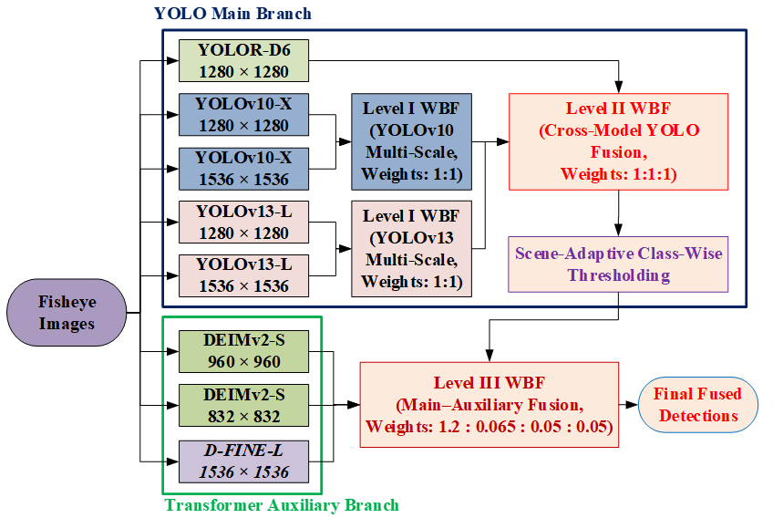

# Role-Separated Hierarchical Fusion for Multi-Scale YOLO–Transformer Fisheye Object Detection

[](https://github.com/bill900214/role-separated-hierarchical-wbf/actions/workflows/artifact-integrity.yml)

Research artifact repository accompanying the manuscript on role-separated hierarchical fusion for fisheye object detection.

> **Role-Separated Hierarchical Fusion for Multi-Scale YOLO–Transformer Fisheye Object Detection**  
> Chun-Ming Tsai, Ding-Jun Huang, Jun-Wei Hsieh, and Ming-Ching Chang  
>  
> 1. Department of Computer Science, University of Taipei, Taipei 10048, Taiwan  
> 2. College of Artificial Intelligence and Green Energy, National Yang Ming Chiao Tung University, Tainan 71150, Taiwan  
> 3. Department of Computer Science, University at Albany, State University of New York, NY 12222, USA  
>  
> Contact: `cmtsai@go.utaipei.edu.tw`, `g11316019@go.utaipei.edu.tw`, `jwhsieh@nycu.edu.tw`, `mchang2@albany.edu`

## Highlights

- Rectification-free fisheye road-object detection.
- Same-model multi-scale fusion for YOLOv10-X and YOLOv13-L.
- A YOLO main branch combining YOLOR-D6, YOLOv10-X, and YOLOv13-L.
- Dataset-specific Day/Night Class-Wise Confidence Thresholding.
- Low-weight Transformer auxiliary predictions from DEIMv2 and D-FINE.
- Final official hidden-test result: **F1 = 0.6604**.

## Method at a Glance

<p align="center">
  
</p>

**Figure 1. Original manuscript flowchart of the role-separated hierarchical WBF pipeline.**  
The Level-II block shows the normalized equal-weight ratio `1:1:1`.
The retained configuration stores the equivalent common-scaled ratio
`9:9:9`; both express the same relative branch weighting.

## Final Configuration

Class order:

```text
Bus, Bike, Car, Pedestrian, Truck
```

### Level I — Same-Model Multi-Scale WBF

| Input | Weights | IoU | Skip threshold | Output threshold |
|---|---:|---:|---:|---:|
| YOLOv10-X 1280 + 1536 | 1:1 | 0.65 | 0.001 | 0.001 |
| YOLOv13-L 1280 + 1536 | 1:1 | 0.65 | 0.001 | 0.001 |

### Level II — YOLO Main Branch

| Inputs | Weights | IoU | Skip threshold | Output threshold |
|---|---:|---:|---:|---:|
| YOLOR-D6 1280 + Y10_MS + Y13_MS | 1:1:1 normalized (`9:9:9` stored) | 0.65 | 0.15 | 0.001 |

### Day/Night Class-Wise Thresholding

Night images are identified by:

```python
str(image_id).startswith("293")
```

Threshold order: `Bus, Bike, Car, Pedestrian, Truck`

```text
Day:   0.28, 0.28, 0.28, 0.28, 0.23
Night: 0.08, 0.13, 0.18, 0.13, 0.18
```

### Level III — Final YOLO–Transformer WBF

| Input | Weight |
|---|---:|
| Thresholded YOLO main branch | 1.2 |
| DEIMv2-S-960 | 0.065 |
| DEIMv2-S-832 | 0.05 |
| D-FINE-L-1536 | 0.05 |

```text
IoU threshold: 0.65
Skip threshold: 0.001
Final confidence threshold: 0.295
Maximum detections per image: 300
```

## Official Result Progression

| Configuration stage | F1 | AP50–95 | AP50 | AP_S | AP_M | AP_L |
|---|---:|---:|---:|---:|---:|---:|
| Historical Raw Equal-Weight WBF† | 0.5719 | 0.6360 | 0.8739 | 0.4983 | 0.7426 | 0.6268 |
| Historical Day/Night Thresholding† | 0.6377 | 0.6033 | 0.8080 | 0.4531 | 0.7284 | 0.6203 |
| Best Recorded YOLO-Only Stage (IoU = 0.6575) | 0.6425 | — | — | — | — | — |
| Selected YOLO–Transformer Setting | 0.6562 | 0.6050 | 0.8060 | 0.4532 | 0.7325 | 0.6196 |
| + Same-Model Multi-Scale YOLO | 0.6596 | 0.6123 | 0.8170 | 0.4665 | 0.7362 | 0.6214 |
| + Final Scene-Specific Thresholding | **0.6604** | **0.6147** | **0.8220** | **0.4709** | **0.7378** | **0.6214** |

† Historical diagnostic stages from early pipeline prototyping. The exact
historical threshold vector associated with the 0.6377 row was not retained.

The manuscript F1 progression is:

```text
0.5719 → 0.6377 → 0.6425 → 0.6562 → 0.6596 → 0.6604
```

The complete Multi-Scale YOLO record is:

```text
F1      = 0.6596
AP50–95 = 0.6123
AP50    = 0.8170
AP_S    = 0.4665
AP_M    = 0.7362
AP_L    = 0.6214
```

All values were returned by the official AI City Challenge evaluation
platform under the same 1,000-image FishEye1K_eval submission protocol.
The machine-readable record is stored in
[`results/official_metrics.csv`](results/official_metrics.csv), with
manuscript-stage notes in
[`docs/RESULTS_PROGRESSION.md`](docs/RESULTS_PROGRESSION.md).

## Five-Minute Artifact Check

```bash
python -m pip install -r requirements.txt
python scripts/validation/verify_repository.py
```

Expected key outputs:

```text
Final prediction: 33,834 detections / 1,000 images
DEIMv2-S-960: 30,460 detections / 1,000 images
Day/Night reconstruction: MATCH
Repository status: PASS
```

See [`docs/REVIEWER_QUICKSTART.md`](docs/REVIEWER_QUICKSTART.md) for the reviewer-oriented verification path.

## Artifact Map

| Method stage | Inputs | Archived output | Main implementation/document |
|---|---|---|---|
| Level I YOLOv10-X | 1280 and 1536 JSON | `Y10_MS_1280_1536.json` | `scripts/fusion/reproduce_level1.sh` |
| Level I YOLOv13-L | 1280 and 1536 JSON | `Y13_MS_1280_1536.json` | `scripts/fusion/reproduce_level1.sh` |
| Level II YOLO main | YOLOR-D6, Y10_MS, Y13_MS | `SEC_MS3_Y10Y13MS_raw.json` | archival MMDetection WBF record |
| Day/Night threshold | YOLO main raw JSON | `MSDN_L_SEC_MS3_DN.json` | `fusion/day_night_classwise_threshold.py` |
| Level III final | YOLO main + three Transformer inputs | `FINAL_MSDN_L_EC2.json` | archival official-submission artifact |

A detailed mapping is provided in [`docs/METHOD_ARTIFACT_MAP.md`](docs/METHOD_ARTIFACT_MAP.md).

A complete hash and detection-count table is provided in [`docs/ARTIFACT_MANIFEST.md`](docs/ARTIFACT_MANIFEST.md).

## Reproducibility Status

| Scope | Status |
|---|---|
| Prediction JSON schema and integrity | Verified |
| Final and DEIMv2-S-960 SHA-256 | Verified |
| Day/Night threshold stage | Exact reconstruction |
| Level I YOLOv13-L | Verified |
| Level I YOLOv10-X | Verified with numerical tolerance near 1e-6 |
| Level II and Level III bit-for-bit recomputation | Archival outputs provided; exact original MMDetection/MMEngine versions were not retained |

The original Level II and Level III experiments used `mmdet.models.utils.weighted_boxes_fusion`. The standalone helper in this repository is not represented as a bit-for-bit replacement for that retained experimental environment.

See [`docs/WBF_REPRODUCIBILITY.md`](docs/WBF_REPRODUCIBILITY.md) and [`docs/RELEASE_STATUS.md`](docs/RELEASE_STATUS.md).

## Data and Checkpoints

- FishEye1K_eval images and hidden reference annotations are not redistributed.
- YOLOR-D6, YOLOv10-X, and YOLOv13-L use public UT-T1 checkpoints; their original training is not claimed as a contribution.
- D-FINE-L-1536 and DEIMv2-S-832 checkpoint records are documented, but binaries are not bundled in normal Git history.
- DEIMv2-S-960 is released as the actual prediction JSON used by Level III; the original checkpoint was not retained in the collected experiment archive.

See [`checkpoints/README.md`](checkpoints/README.md), [`docs/DFINE_THREE_STAGE.md`](docs/DFINE_THREE_STAGE.md), and [`docs/DEIMV2.md`](docs/DEIMV2.md).

Training-data and annotation availability is documented in [`docs/DATA_AND_ANNOTATION_STATUS.md`](docs/DATA_AND_ANNOTATION_STATUS.md).

## Repository Layout

```text
.
├── .github/workflows/
├── checkpoints/
├── code/
├── configs/
├── docs/
├── environment/
├── fusion/
├── legacy/
├── predictions/
├── results/
├── scripts/
├── third_party/
├── CITATION.cff
├── THIRD_PARTY_NOTICES.md
└── requirements.txt
```

## Citation

Citation metadata is provided in [`CITATION.cff`](CITATION.cff).

Exact title, author order, affiliations, and verified ORCID records are documented in [`docs/MANUSCRIPT_METADATA.md`](docs/MANUSCRIPT_METADATA.md).

## License and Third-Party Notice

Original project-specific code and documentation are released under
[`AGPL-3.0`](LICENSE).

Detector-specific files, configurations, and dependencies associated with
YOLOR, YOLOv10, YOLOv13, DEIMv2, D-FINE, and UT-T1 remain subject to their
upstream terms. See [`NOTICE`](NOTICE),
[`THIRD_PARTY_NOTICES.md`](THIRD_PARTY_NOTICES.md), and
[`third_party/README.md`](third_party/README.md).
